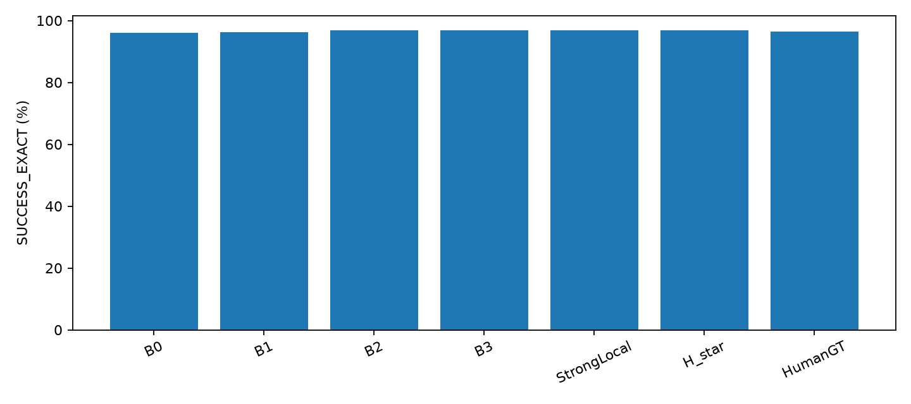
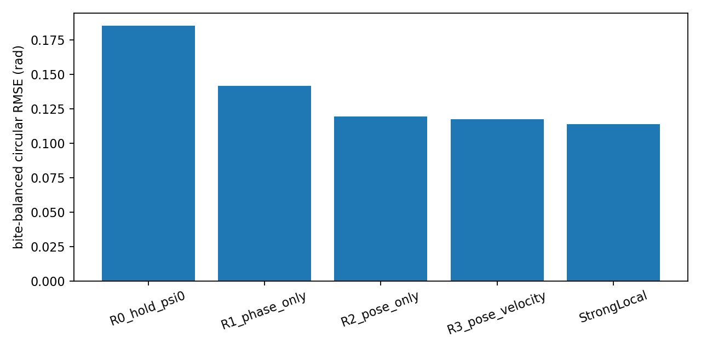
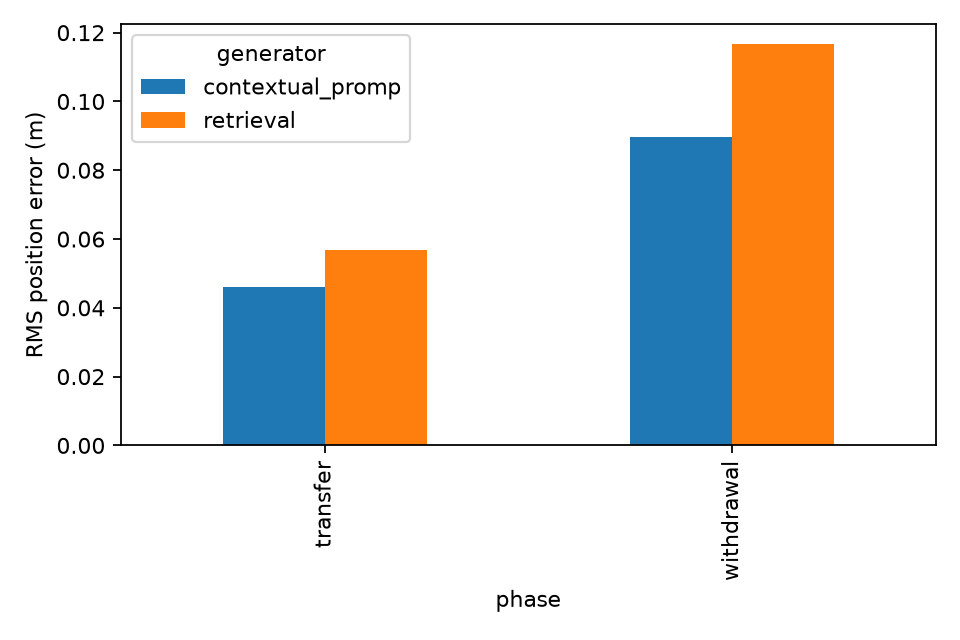
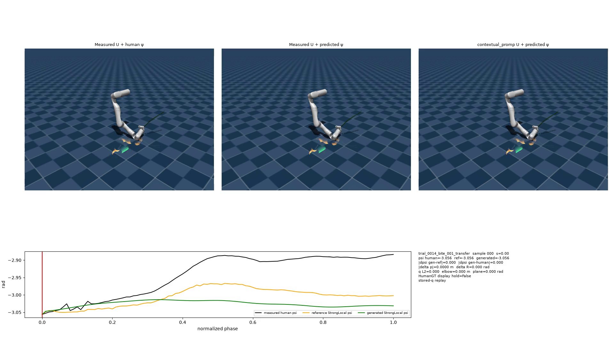
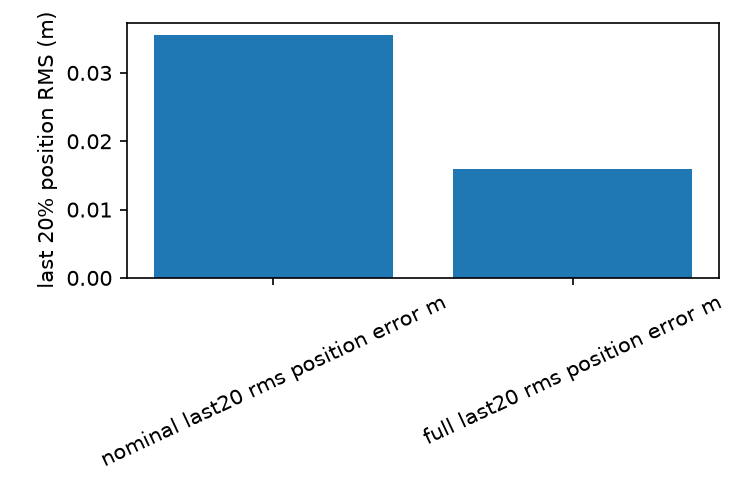
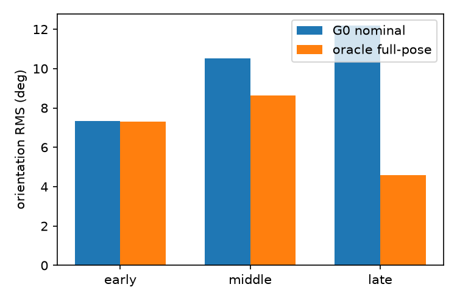
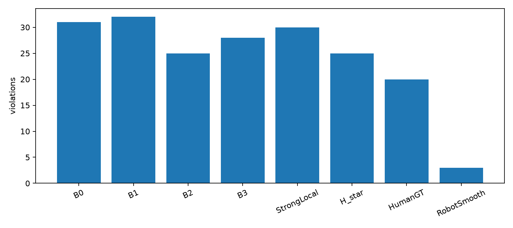

# Feeding Coordination：近期进展（导师汇报）

> 本文只整理已有离线结果和图片；“手部终点”指留出样本最后一帧的 Hand 位置，不是真实嘴部位置或实机精度。

## 1. 从模仿手臂姿势到精确到达末端位置

**SEW-Mimic：**参考人的肩、肘、腕相对姿势，让七自由度机械臂摆出相近的手臂形状。

**Exact-SEW：**在保持指定手臂冗余角的同时，让机械臂末端准确到达给定的位置和方向。

旧仓库保存的**同一组前 100 帧**结果（位置误差均针对物理夹持点）：

| 方法 | 成功帧 | 平均位置误差 | 最大位置误差 | 对齐后的方向误差 |
|---|---:|---:|---:|---:|
| SEW-Mimic | 100/100 | **9.03 cm** | **11.06 cm** | 0° |
| Exact-SEW | 100/100 | **2.08×10⁻⁹ cm** | **7.32×10⁻⁹ cm** | 0° |

| 当前 feeding 数据集：Exact-SEW + 实测人体冗余角 | 结果 |
|---|---:|
| 有效目标帧 | 32,216 |
| 成功求解帧 | **31,058（96.41%）** |
| 成功帧最大末端位置 / 方向残差 | **1.5×10⁻⁹ m / 9.0×10⁻⁹ rad** |

*图 1：同一批末端目标、不同冗余角输入；HumanGT 是实测值，不是预测值。*

## 2. 预测手臂的冗余角

**StrongLocal：**根据当前叉子的姿势、移动速度、动作阶段和餐盘位置，预测手臂冗余角相对起点会改变多少。

| 固定输入 `x` | 具体内容 | 维数 |
|---|---|---:|
| 叉子相对位姿 | 相对起点的位置 3 维 + 方向 3 维 | 6 |
| 速度 | 当前线速度 3 维 + 角速度 3 维（仅用此前数据） | 6 |
| 运动进度与阶段 | 归一化进度 `s` + transfer / withdrawal 标志 | 3 |
| 餐盘信息 | 相对餐盘位置 3 维 + 数据有效标志 | 4 |
| **合计** |  | **19** |

`z = (x − μ) / σ`，`预测的 Δψ = wᵀz + b`，`预测的 ψ = ψ₀ + Δψ`。

*Ridge Regression 训练后，标准化参数 `μ、σ` 和权重 `w、b` 全部冻结；运行时只做一次固定计算，不在线重训。*

| 方法 | 冗余角预测误差 RMSE | 换算为角度 |
|---|---:|---:|
| 始终保持起点角度 | 0.1852 rad | 10.61° |
| 只看当前姿势 | 0.1193 rad | 6.84° |
| 当前姿势 + 速度 | 0.1174 rad | 6.73° |
| **StrongLocal** | **0.1139 rad** | **6.53°** |

*StrongLocal 相比保持起点角度，RMSE 降低 **38.5%**；评估时整次录制均被留出。*

*图 2：数值越低越好。*

## 3. 预测叉子的移动轨迹

**Retrieval：**从训练数据中挑一条情况相近的轨迹，并调整到当前起点。

**Contextual ProMP：**从起点姿势和任务环境预测一整条平滑的叉子位置、方向轨迹。

127 条留出 transfer 的结果：

| 方法 | 整段叉子位置误差 RMS | 整段方向误差 RMS | **终点 Hand 平均误差** | **终点 Hand 最大误差** | 终点方向平均误差 |
|---|---:|---:|---:|---:|---:|
| Retrieval | 5.68 cm | 12.13° | **1.82 cm** | 5.66 cm | 15.48° |
| Contextual ProMP | **4.61 cm** | **9.43°** | 1.91 cm | **5.44 cm** | **13.31°** |

*ProMP 的整段轨迹更准，但终点 Hand 的平均误差并未优于 Retrieval。*

*图 3：图片展示叉子轨迹的误差；表中的终点位置单独换算成 Hand 误差。*

将预测轨迹、预测冗余角和 Exact-SEW 接起来的离线求解：

| 轨迹来源 | 全段成功求解 |
|---|---:|
| Contextual ProMP | **224/246（91.1%）** |
| Retrieval | 201/246（81.7%） |

*图 4：左、中、右分别逐步加入预测冗余角和预测叉子轨迹；[已有完整视频](../outputs/generator_g1_visualization/videos/three_way_8segment_1080p.mp4)。*

## 4. 约束关键终点的位置和方向

**G2A：**保留 ProMP 轨迹的大部分形状，用已有数据派生的临时终点平滑调整最后一段位置，方向不变。

**G2B：**把留出样本最后一帧的 Hand 位置和叉子方向作为已知目标，平滑调整末段位置与方向，并比较“只调位置”的情况。

同一 127 条 transfer 的**终点 Hand 位置**对比：

| 轨迹 | 终点 Hand 平均误差 | 终点 Hand 最大误差 | 终点方向平均误差 |
|---|---:|---:|---:|
| 原始 ProMP | 1.91 cm | 5.44 cm | 13.31° |
| G2A：临时目标，仅调位置 | **1.63 cm** | 5.69 cm | 13.31° |
| G2B：已知最终 Hand，仅调叉子位置 | 2.03 cm | 7.12 cm | 13.31° |
| **G2B：已知最终 Hand，同时调位置和方向** | **约 0 cm** | **约 0 cm** | **约 0°** |

*Hand 位置按项目使用的 10 cm 叉—手偏移换算；只调叉子位置时，方向误差仍会影响换算后的 Hand 位置。*

末段约束前后的**整段叉子轨迹**对比：

| 指标 | 原始 ProMP | G2B：仅调位置 | G2B：位置 + 方向 |
|---|---:|---:|---:|
| 整段位置误差 RMS | 4.61 cm | 4.21 cm | **4.21 cm** |
| 整段方向误差 RMS | 9.43° | 9.43° | **7.28°** |
| 最后 20% 位置误差 RMS | 3.56 cm | 1.59 cm | **1.59 cm** |
| 最后 20% 方向误差 RMS | 12.18° | 12.18° | **4.58°** |

*图 5：叉子轨迹最后 20% 的位置误差明显下降。*

*图 6：同时约束方向后，改善主要出现在接近终点的阶段。*

## 5. 与已有研究相比，问题重点在哪里？

| 相关工作 | 主要研究什么 | 本项目重点 |
|---|---|---|
| [喂食 + ProMP（Canal 等，2016）](https://www.iri.upc.edu/publications/show/1792) | 从示范学习并个性化喂食轨迹 | ProMP 只是辅助生成叉子轨迹；主要问题是**同一叉子轨迹下手臂冗余角如何变化**。 |
| [类人动作规划（Gulletta 等，2021）](https://journals.sagepub.com/doi/10.1177/1729881421998585) | 用目标姿势和规划代价生成类人手臂运动 | 从真实喂食示范中测量并学习人的冗余协调 `ψ`。 |
| [冗余控制（Atawnih 等，2016）](https://www.sciencedirect.com/science/article/abs/pii/S0921889016000130) | 在完成末端任务时利用冗余避开关节限制 | 比较从人体动作学到的 `ψ` 与机器人自身选出的 `ψ`。 |
| [SEW-Mimic](https://arxiv.org/abs/2602.01632) / [WARP](https://arxiv.org/abs/2606.29940) | 将已知人体动作映射成机器人动作 | 学习**任务状态 → 冗余协调**；运行时不需要逐帧人体骨架，但仍需叉子状态和初始冗余角。 |
| [机器人中心的零空间优化示例](https://iris.unicas.it/retrieve/0d91bd7a-b816-45f7-bb27-2c822b6651d9/CODIT2023.pdf) | 根据机器人可操作度、关节限制等选择冗余动作 | 在相同末端任务下，比较**像人**与**机器人自身运动连续**的取舍。 |

*这是研究问题和实验设计的区别，不是与这些论文在同一数据集上的性能排名。*

## 6. 本项目可强调的新颖性

| 贡献 | 简单解释 | 已有证据 |
|---|---|---|
| **任务—协调解耦** | 把一段喂食动作写成 `τ(t) = {U(t), ψ(t)}`：`U` 是叉子任务，`ψ` 是整条手臂怎样利用多余自由度；不直接复制人的肘部 XYZ。 | 同一表示贯穿冗余预测、固定叉子轨迹的机器人比较和生成轨迹实验。 |
| **喂食冗余的实证比较** | 依次比较姿势、速度、阶段/餐盘，以及历史、未来、完整计划提供的信息。 | StrongLocal 的 RMSE 为 **0.1139 rad**；在当前数据和检验中，加入历史/未来/完整计划**没有可靠额外收益**。 |
| **严格的同任务机器人比较** | 固定虚拟叉子轨迹 `U_A(t) = U_B(t)`、机器人、起点和 Exact-SEW，只改变输入的 `ψ(t)`。 | R0/R1 隔离了不同冗余策略对求解率、手臂姿势和连续性的影响。 |
| **人体相似性与机器人连续性的取舍** | 人体实测角度最忠实于人体；机器人中心策略可减少部分关节运动中断，却会离人体动作更远。 | 下表为 HumanGT 与 RobotSmooth 的同任务比较。 |

| RobotSmooth − HumanGT（按 bite 配对） | 差值 | 含义 |
|---|---:|---|
| 相对人体 `ψ` 的平均绝对误差 | **+0.126 rad** | 更不像人体冗余协调 |
| 相对 HumanGT 的机器人肘部平均误差 | **+3.33 cm** | 更不像人体参考手臂构型 |
| 关节速度 RMS | **−0.052 rad/s** | 在该指标上运动更缓 |
| 连续性中断次数 | **−0.067 次/bite** | 在该指标上中断更少 |

*图 7：图中是全量中断次数，上表是按 bite 配对的差值；RobotSmooth 不能称为“所有指标最平滑”，其成功帧率为 **95.38%**，低于 HumanGT 的 **96.41%**，且配对 jerk 差为 **+367 rad/s³**。*

**下一步关键问题：**能否把人体协调当作初始偏好，再根据机器人自身限制调整，而不是只在“完全模仿”和“只求机器人连续”之间二选一？

*新颖性在喂食任务的表示、人体数据实证和受控机器人比较；ProMP、Ridge、SEW 和 Exact-SEW 算法本身不是本项目新提出的。*

**汇报最后一句：**我们不是直接复制人的关节运动，而是把叉子任务与手臂冗余协调分开，学习人在喂食时如何使用冗余自由度，并在完全相同的叉子轨迹下检验它对机器人全臂运动的影响。

> Instead of directly copying human joint motion, we separate the feeding task from whole-arm redundancy, learn how people coordinate the arm for that task, and compare robot behavior under the same fork path.

## 汇报总结

| 汇报结论 | 当前结果 |
|---|---|
| 手臂姿势与末端位置 | SEW-Mimic 模仿手臂形状；Exact-SEW 满足给定末端目标。 |
| 轨迹预测 | ProMP 的整段误差较低，但终点 Hand 平均仍差约 **1.91 cm**。 |
| 终点约束 | 已知最终 Hand 位置和叉子方向时，G2B 的终点误差接近数值零。 |
| 尚未验证 | 独立感知目标、实际工具标定、碰撞与实机安全。 |

*终点约束使用了留出样本的最后一帧，证明的是离线“给定正确目标后能否到达”，不是提前预测未来或实机喂食成功率。*

数据与图片来源：[旧仓库 SEW-Mimic 逐帧结果](../../sew_mimic_repro/output/baseline_metrics.csv)、[旧仓库 Exact-SEW 逐帧结果](../../sew_mimic_repro/output/comparison_frames.csv)、[冗余角](../outputs/phase32/summary.json)、[历史/未来消融](../outputs/phase31/summary.json)、[机器人求解](../outputs/robot_r0/summary.json)、[机器人连续性](../outputs/robot_r1/summary.json)、[机器人质量配对比较](../outputs/robot_r2/summary.json)、[轨迹预测](../outputs/generator_g0/summary.json)、[全链条](../outputs/generator_g1/summary.json)、[G2A](../outputs/generator_g2a/summary.json)、[G2B 轨迹](../outputs/generator_g2b/generated/oracle_full_pose_constrained)、[G2B 汇总](../outputs/generator_g2b/summary.json)。
